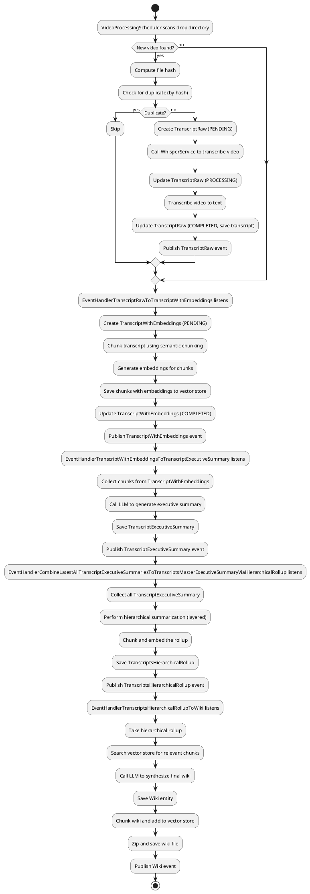
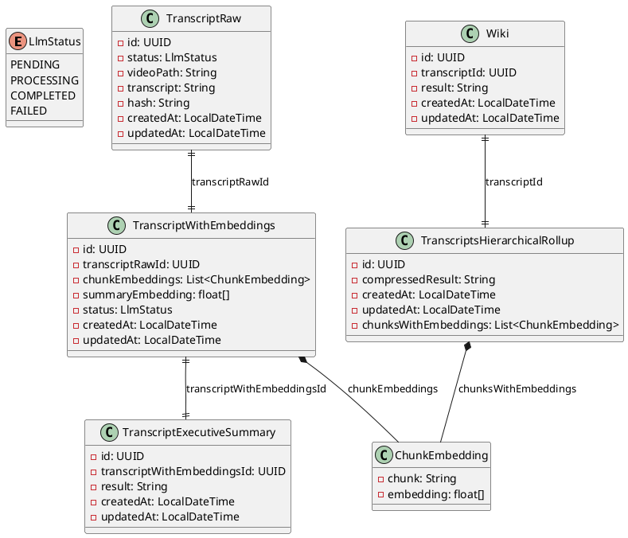

# Video Notes to Wiki

## Overview

Video Notes to Wiki is a service that automatically converts video content into structured wiki documentation. It transcribes videos using Whisper AI, processes transcripts with large language models (LLMs) to extract key insights, and synthesizes them into a comprehensive knowledge base. The resulting documentation can be queried via API and exported as wiki pages.

At a high level, the service:
- Scans a designated input directory for video files
- Transcribes them to text using Whisper
- Chunks and embeds the transcripts for semantic search
- Generates executive summaries using LLMs
- Performs hierarchical summarization to combine multiple videos
- Creates final wiki documentation
- Stores everything in a vector database for querying

## Architecture

The system uses an event-driven architecture with reactive streams. Videos are processed asynchronously through a pipeline of event handlers that transform data progressively.

### Activity Diagram: Video to Wiki Flow

### Entities Class Diagram

### Services and Components Class Diagram

```plantuml
@startuml Services Class Diagram

package "Services" {
    class VideoProcessingScheduler {
        - transcriptService: TranscriptService
        - videoConfig: VideoConfig
        - eventStream: EventStream<TranscriptRaw>
        - transcriptRepository: TranscriptRepository
        + scanAndProcessVideos()
        + moveFileToTranscribed()
    }

    class TranscriptService {
        - transcriptRepository: TranscriptRepository
        - whisperService: WhisperService
        - eventStream: EventStream<TranscriptRaw>
        + createTranscript(videoPath: String): Mono<TranscriptRaw>
    }

    class WhisperService {
        + transcribeVideo(videoPath: String): Mono<String>
    }

    class EmbeddingService {
        + embed(texts: List<String>): List<float[]>
    }
}

package "Event Handlers" {
    class EventHandlerTranscriptRawToTranscriptWithEmbeddings {
        - transcriptEventStream: EventStream<TranscriptRaw>
        - transcriptWithEmbeddingsRepository: TranscriptWithEmbeddingsRepository
        - transcriptRepository: TranscriptRepository
        - embeddingService: EmbeddingService
        - eventStream: EventStream<TranscriptWithEmbeddings>
        + processTranscriptEvent()
    }

    class EventHandlerTranscriptWithEmbeddingsToTranscriptExecutiveSummary {
        - eventStream: EventStream<TranscriptWithEmbeddings>
        - transcriptExecutiveSummaryRepository: TranscriptExecutiveSummaryRepository
        - transcriptWithEmbeddingsRepository: TranscriptWithEmbeddingsRepository
        - webClientBuilder: WebClient.Builder
        - wikiReadyTranscriptEventStream: EventStream<TranscriptExecutiveSummary>
        + processTranscriptWithEmbeddingsEvent()
    }

    class EventHandlerCombineLatestAllTranscriptExecutiveSummariesToTranscriptsMasterExecutiveSummaryViaHierarchicalRollup {
        - wikiReadyTranscriptEventStream: EventStream<TranscriptExecutiveSummary>
        - transcriptExecutiveSummaryRepository: TranscriptExecutiveSummaryRepository
        - transcriptsHierarchicalRollupRepository: TranscriptsHierarchicalRollupRepository
        - webClientBuilder: WebClient.Builder
        - compressedTranscriptsEventStream: EventStream<TranscriptsHierarchicalRollup>
        + performHierarchicalRollup()
    }

    class EventHandlerTranscriptsHierarchicalRollupToWiki {
        - compressedTranscriptsEventStream: EventStream<TranscriptsHierarchicalRollup>
        - webClient: WebClient
        - wikiRepository: WikiRepository
        - wikiResultEventStream: EventStream<Wiki>
        - vectorStore: VectorStore
        + processCompressedTranscriptsEvent()
    }
}

package "Event System" {
    interface EventStream<T> {
        + getEventStream(): Flux<T>
        + publish(event: T): Mono<Void>
    }

    class EventStreamInMemoryImpl<T> implements EventStream<T> {
        - processor: EmitterProcessor<T>
        - sink: FluxSink<T>
    }
}

package "Controllers" {
    class TranscriptRawController {
        // Handles transcript raw operations
    }

    class KnowledgeBaseController {
        // Handles knowledge base queries
    }
}

VideoProcessingScheduler --> TranscriptService : uses
TranscriptService --> WhisperService : uses
TranscriptService --> EventStream : publishes
EventHandlerTranscriptRawToTranscriptWithEmbeddings --> EmbeddingService : uses
EventHandlerTranscriptRawToTranscriptWithEmbeddings --> EventStream : subscribes/publishes
EventHandlerTranscriptWithEmbeddingsToTranscriptExecutiveSummary --> EventStream : subscribes/publishes
EventHandlerCombineLatestAllTranscriptExecutiveSummariesToTranscriptsMasterExecutiveSummaryViaHierarchicalRollup --> EventStream : subscribes/publishes
EventHandlerTranscriptsHierarchicalRollupToWiki --> EventStream : subscribes/publishes

@enduml
```

## Setup and Boot Up

### Prerequisites
- Docker and Docker Compose
- Java 17+ (for local development)
- Maven (for local development)

### Using Docker Compose
1. Clone the repository
2. Ensure Docker and Docker Compose are installed
3. Run `docker-compose up` from the project root
4. The services will start:
   - PostgreSQL database on port 5432
   - Spring Boot app on port 8080
   - Ollama (LLM service) on port 11434
   - Chroma (vector database) on port 8000
   - Whisper wrapper (transcription service)

### Local Development
1. Start the external services (PostgreSQL, Ollama, Chroma) using `docker-compose up postgres ollama chroma whisper-wrapper`
2. Run the Spring Boot app with `mvn spring-boot:run`

## Usage

1. **Add Videos**: Place video files (.mp4, .avi, .mov, .mkv) in the `media-input` directory
2. **Automatic Processing**: The VideoProcessingScheduler scans every minute and processes new videos
3. **Monitor Progress**: Check logs or database for processing status
4. **Query Knowledge Base**: Use the API endpoints on port 8080 to query the knowledge base
5. **Export Wiki**: Generated wiki files are zipped and saved in the configured output directory

### API Endpoints
- `GET /api/transcripts` - List transcripts
- `POST /api/transcripts` - Upload transcript (alternative to file drop)
- `GET /api/knowledge-base/query` - Query the knowledge base

### Configuration
- Input directory: `media-input`
- Output directory: Configurable via `app.output.directory`
- LLM settings: Configure via `llmConfig` properties

## Development

- Diagrams are stored in `src/docs/` as PlantUML files
- Run tests with `mvn test`
- Build with `mvn clean package`